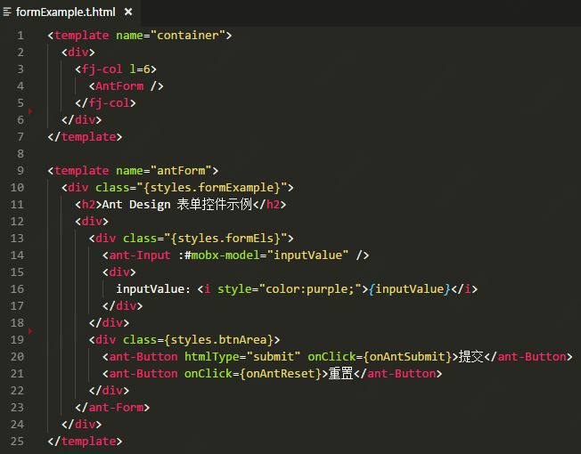

# NornJ-loader

Webpack loader for template engine NornJ

[![NPM Version][npm-image]][npm-url]
[![NPM Downloads][downloads-image]][npm-url]

## 概述

`nornj-loader`用于在`Webpack`环境下，将`NornJ`的`单文件模板`编译为模板函数，与传统js模板引擎的`webpack-loader`(如[handlebars-loader](https://github.com/pcardune/handlebars-loader))作用是类似的。模板示例：



### 安装

使用npm安装:

```sh
npm install nornj-loader
```

### Loader配置

* 渲染字符串

```js
  ...
  module: {
    rules: [
      {
        test: /\.nj.html(\?[\s\S]+)*$/,
        loader: 'nornj-loader'
      }
    ]
  },
```

* 渲染`React vdom`

```js
  ...
  module: {
    rules: [
      {
        test: /\.nj.html(\?[\s\S]+)*$/,
        loader: 'nornj-loader',
        options: {
          outputH: true,
          delimiters: 'react'
        }
      }
    ]
  },
```

### 模板函数的使用方法

```js
import { registerTmpl } from 'nornj-react';
import tmpls from '../template.nj.html';

@registerTmpl('AddTodo')
export default class AddTodo extends Component {
  ...
  render() {
    return tmpls.addTodo(this.state, this, { foo: 1 });
  }
}

@registerTmpl('TodoList')
export default class TodoList extends Component {
  ...
  render() {
    return tmpls.TodoList(this.props, { bar: 2 });
  }
}
```

具体的使用文档[请点这里](https://github.com/joe-sky/nornj/blob/master/docs/%E5%9C%A8%E7%8B%AC%E7%AB%8B%E6%A8%A1%E6%9D%BF%E6%96%87%E4%BB%B6%E4%B8%AD%E5%88%86%E6%A8%A1%E5%9D%97%E6%9E%84%E5%BB%BA.md)。

### License

MIT

[npm-image]: http://img.shields.io/npm/v/nornj-loader.svg
[downloads-image]: http://img.shields.io/npm/dm/nornj-loader.svg
[npm-url]: https://www.npmjs.org/package/nornj-loader